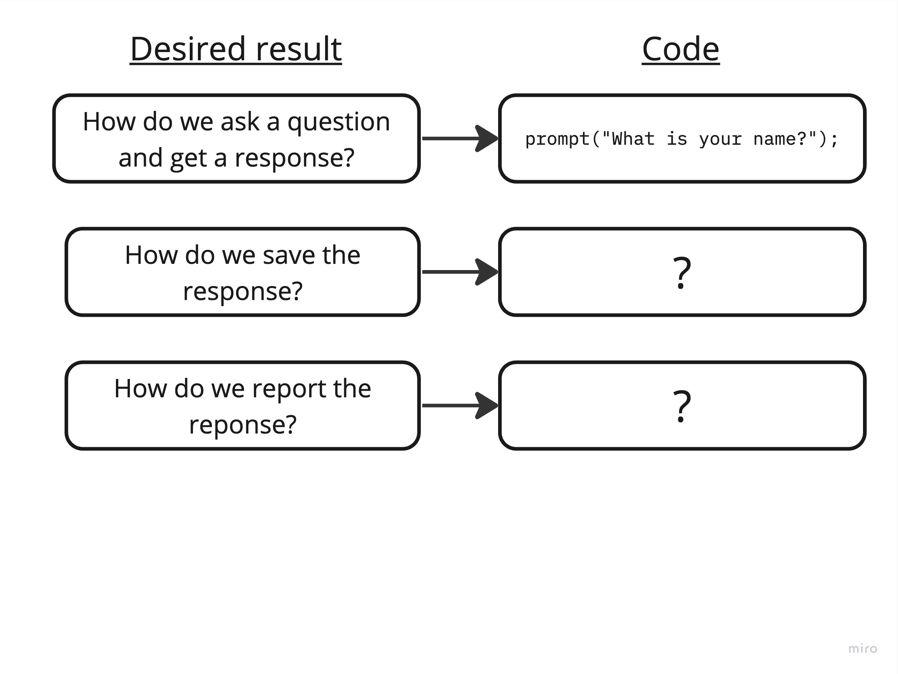
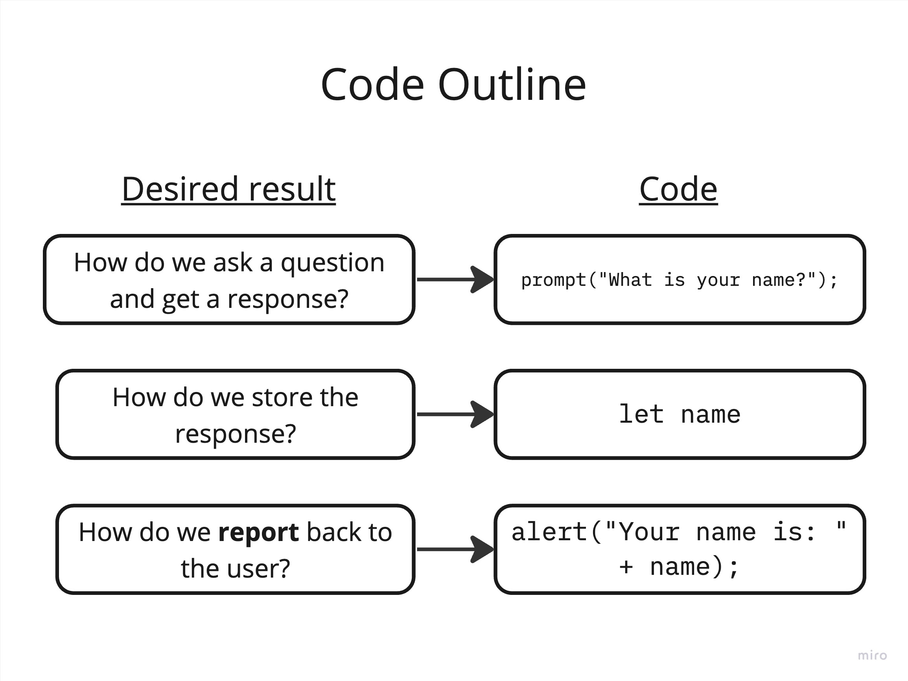

# Lab: Let's get started

Read this document in its entirety before beginning your lab.

## Problem Domain

Create a webpage that accepts user input and, based on that input, displays messages back to the user.

## Instructions

- Set up the HTML document `<body>` with `<header>`, `<main>`, and `<footer>` elements.
- In the `<main>` of the file, place a `<h1>` tag with the content "Class 1 Lab". Style this element with text and background colors via an internal `<style>` element placed in the `<head>` of your document.
- In the HTML portion of the file, place the four questions within a series of `
` tags so that they are listed on the screen.
- Give each `
` tag a different text color and background color by using inline styling.

- Using a total of four JavaScript 'prompt' statements along the lines of our class demo, have a user answer four questions.
- The user's response to each question (input) should be stored in a separate variable. Name your variables carefully and `let` to define your variables.
- Using these responses, return an alert to the user (output) that concatenates their response into some kind of reply like we did in class.
- Strive to have your alert for each question utilize the responses to all of the prior questions such that by the fourth question, your response would look something like, "Greetings, *Iggy* from *Ipanema*, I also like to eat *bananas* while on vacation in *Paris*."
- Be creative and have fun with your questions/responses! They can be whatever you want so long as the input/output requirements are met.
- In addition, for each response, create a console.log() message that indicates the nature of the question and the user's response, as we did in class.

## UI/UX Flow Chart

This flow chart will show an overview of the user experience from start to finish.

## Code Outline

The follow diagram shows the code we use use to complete our program. (The chart is incomplete. Try to see if you can complete it.)

### Chart (incomplete)

### Chart (complete)

This is the competed chart. Were you right?

## Using Lighthouse

Lighthouse is used to check if your website is accessible to people with limited vision. There are ways to make your website easier to navigate for people using screen-readers or are color-blind. Use Lighthouse to automatically check if your website is compatible with screen-readers.

- Using Lighthouse in the Chrome DevTools, analyze the accessibility of your application.
- The following options to generate a Lighthouse report should be selected:
  - Mode: Navigation
  - Device: Desktop
  - Categories: Accessibility
- A score between 50-65 is a great place to start for this first lab.

### Stretch Goals

After completing all of the requirements listed above, you may optionally challenge yourself further by implementing some or all of the following into your application.

- Utilizing internal and inline styling as you wish, apply additional styling to the page: try things like borders, alignment, margin, padding, and so on.
- Search for an online HTML validator and submit your code to it. Take a screenshot of your output and submit the image.
- Visit [this page](https://developers.google.com/web/tools/chrome-devtools/accessibility/reference){:target="_blank"} and read about Chrome's built-in accessibility auditing tools. Following the instructions under the "View the contrast ratio of a text element in the Color Picker" heading, examine the contrast ratio values of your heading and paragraph tags. Modify your code until you can achieve a ratio with that gets two check marks. Submit a screenshot of the Chrome tools showing this off.

## Resources

Refer to the code demo from today as a starting point for this lab assignment.

## Submission Instructions

- Go to [https://gist.github.com](https://gist.github.com){:target="_blank"}.
- In the "Gist description..." field, put your name.
- In the "Filename including extension..." field put 'index.html'.
- Copy-paste your code into the big input field for the Gist.
- Select the button that says "Create secret gist".
- Choose the "Share" option in the drop down list next to the link.
- Copy the link from the Gist screen for submission in the URL field below.
