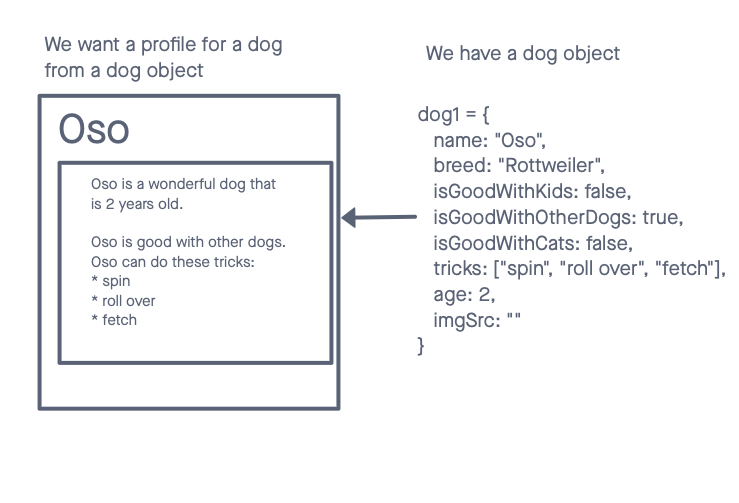

# Class 07 Introducing Objects, Classes, and HTML Tables

We will learn how Objects can help organize your variables, and do so much more!

### References

* Replit for Day 26 [Replit](https://replit.com/@code-201-n1/createElementLoop) [GitHub](https://github.com/rmccrear/createElementLoop/tree/day-26)

### Objects and member variables

Naming variables is important. Changing the name of variables, helps us pass them from control structure to control structure. 

Even though they have the same value, it might be easier to work with your data if it has a different name, or is a member of an object. This is a very important part of building computer programs.

Watch the Objects section of this video for more: https://youtu.be/W6NZfCO5SIk?t=1808

Go from this:

    // define the sugarcookie
    let sugarcookiePrice = 3.00;
    let sugarcookieQty = 5;
    let sugarcookieTotal = sugarcookiePrice * sugarcookieQty;

    // defind the gingerbread
    let gingerbreadPrice = 5.00;
    let gingerbreadQty = 4;
    let gingerbreadTotal = gingerbreadPrice * gingerbreadQty;

    // print them out
    console.log(`Your total is ${sugarcookieTotal} for ${sugarcookieQty} Sugar Cookies`);
    console.log(`Your total is ${gingerbreadTotal} for ${gingerbreadQty} Gingerbread Cookies`);

To this:

    let sugarcookie = {
      name: "Sugar Cookie",
      price: 3.00,
      qty: 5
    }
    sugarcookie.total = sugarcookie.price * sugarcookie.qty

    let gingerbread = {
      name: "Gingerbread Cookie",
      price: 5.00,
      qty: 4
    }
    gingerbread.total = gingerbread.price * gingerbread.qty

    // print them out
    for(let coookie of [sugarcookie, gingerbread]) {
      console.log(`Your total is ${cookie.total} for ${cookie.qty} ${cookie.name}s`);
    }

### Videos

Here are three videos from Badgr that will help with Lab 06-2 and Lab 07.

The first is about Loops. Watch this on loop! It’s only 6 minutes.
If you are repeating yourself in your code, that is fine for now. But it’s also a good opportunity to use a loop! https://youtu.be/s9wW2PpJsmQ

The second is about document.getElementById(“#something-something”). We talked about it before, but it will be useful for the lab. So it’s a good review. https://youtu.be/t90K6HExEJo

The third is document.createElement(“p”). We touched on this on Thursday when we placed cookies into the cookie box during the in-class Replit. This video goes into more detail about it. It also talks about forms, which we will talk about later. https://youtu.be/Nx2AhrCIlXE?t=26

#### Here is a list of all the videos mentioned above.

* Objects: https://youtu.be/W6NZfCO5SIk?t=1808
* Loops: https://youtu.be/s9wW2PpJsmQ
* document.getElementById() https://youtu.be/t90K6HExEJo
* document.createElement() https://youtu.be/Nx2AhrCIlXE?t=26
* Functions: https://youtu.be/W6NZfCO5SIk?t=2384

## Day 27

### Outline for the day

1. OOP 1 (Object Oriented Programming)
2. Replit for OOP 1
3. Cat rescue center demo
4. Review Lab 06/07 wireframe

### OOP

Object Literals. 

#### Person has a ____.

Has-a relationship.

Has-many relationship

    person1 = {
      firstName: "Robert",
      lastName: "McCreary"
      car: "Toyota Prius",
    }

#### Restaurant has a _____.

    restaurant1 = {
      name: "The Select", // one
      vipCust: [
        "Dee", 
        "Bee", 
        "Anya", 
        "Cee"
      ], // many
      cuisine: "French"
    }

### Object Properties: 
name, vipCust, cuisine.

### Instance key/value pairs:

name: "The Select"

vipCust: [...]

cuisine: French

### String Interpolation

    let name = "Robert";
    let greeting = `Hello, ${name}. Welcome to Nashiville.`;

    Hello Robert. Welcome to Nashvile.

### Function for greeting

I have a person object.

I want to say hello to the person.

Write a function that will say hello to the person.

    function greeting(person) {
      let message = `Hello, ${person.firstName}. Welcome to Nashiville.`;
      alert(message); 
    }

    greeting(person1);

### Replits for Day 27

https://replit.com/@code-201-n1/OOP1-Node#index.js:want

https://replit.com/@code-201-n1/OPP-1-HTML#script.js

### Live demo Dog Shelter

[Dog Shelter App Version 1.0](../class-06/demo/domain-modeling-and-dom)

